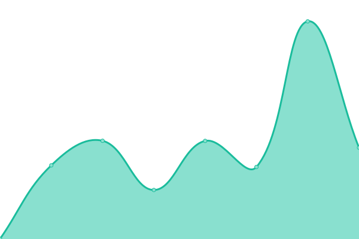
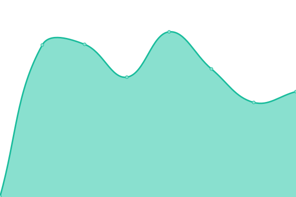

# [📈 Live Status](https://upptime.github.io/upptime): <!--live status--> **🟧 Partial outage**

This repository contains the open-source uptime monitor and status page for Hiveon Services.

<!--start: status pages-->
<!-- This summary is generated by Upptime (https://github.com/upptime/upptime) -->
<!-- Do not edit this manually, your changes will be overwritten -->
<!-- prettier-ignore -->
| URL | Status | History | Response Time | Uptime |
| --- | ------ | ------- | ------------- | ------ |
|  [Hiveos Farm](https://the.hiveos.farm) | 🟩 Up | [hiveos-farm.yml](https://github.com/the3line/upptime2/commits/HEAD/history/hiveos-farm.yml) | 

 1133ms
     
 | 

<a href="https://the3line.github.io/upptime2/history/hiveos-farm">100.00%</a>
    

|  [Hiveos Farm API](https://api2.hiveos.farm/api/v2/healthcheck) | 🟥 Down | [hiveos-farm-api.yml](https://github.com/the3line/upptime2/commits/HEAD/history/hiveos-farm-api.yml) | 

 500ms
     
 | 

<a href="https://the3line.github.io/upptime2/history/hiveos-farm-api">100.00%</a>
    

|  [Pool Health](https://hiveon.net/api/v1/pool/health) | 🟩 Up | [pool-health.yml](https://github.com/the3line/upptime2/commits/HEAD/history/pool-health.yml) | 

 396ms
     
 | 

<a href="https://the3line.github.io/upptime2/history/pool-health">100.00%</a>
    

<!--end: status pages-->

## 📄 License

- Powered by: [Upptime](https://github.com/upptime/upptime)
- Code: [MIT](./LICENSE) © [Anand Chowdhary](https://anandchowdhary.com), supported by [Pabio](https://pabio.com)
- Data in the `./history` directory: [Open Database License](https://opendatacommons.org/licenses/odbl/1-0/)
